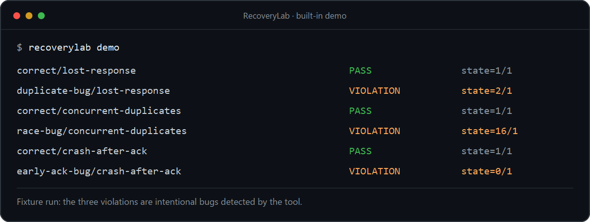

# RecoveryLab

**A local failure lab for APIs that write data.**

Imagine your API creates an order and sends `200 OK`, but the response disappears on the way back. The client retries. RecoveryLab recreates that moment, then checks whether the order was created once or twice.

It can also send duplicate requests at the same time or restart your service after a process crash. RecoveryLab checks what changed in the state your local HTTP service exposes, instead of trusting the HTTP status alone.



## See it run

With [Go 1.23+](https://go.dev/dl/) installed, run this from the repository root:

```sh
go run ./cmd/recoverylab demo
```

The demo starts its own test servers. You don't need Docker, an account, or an API key. For each failure, it shows a server that handles it correctly and one with a deliberate bug:

```text
A write succeeds, its reply vanishes, and the client retries. (observed/expected)
Lost response: correct PASS 1/1 | duplicate bug VIOLATION 2/1
16 requests at once: correct PASS 1/1 | race bug VIOLATION 16/1
Crash after 2xx: correct PASS 1/1 | early ack bug VIOLATION 0/1
Demo passed: 3 healthy cases held; 3 injected defects were detected.
```

The numbers are observed/expected state values. `VIOLATION 2/1` means two writes occurred when the scenario expected one. A `VIOLATION` is the *correct* result for a deliberately buggy fixture.

The built-in servers make those bugs easy to reproduce. A race in your own service may take several runs to catch.

Here are three checks outside the built-in demo:

| Service | Lost-response test |
| --- | --- |
| [NetCore](https://github.com/Wali05/NetCore), my own project | Allocation count `0 → 2`; `VIOLATION` when the test expected one. |
| [PocketBase](https://github.com/pocketbase/pocketbase), an unrelated project | Record count `0 → 2`; `VIOLATION` when the test expected one. |
| [Spring Boot idempotency sample](https://github.com/arthurfaby/spring-boot-starter-idempotency), an unrelated project | Ledger count `0 → 1`; `PASS` with the same idempotency key on the retry. |

Those results show what happened in these setups, not a bug in NetCore or PocketBase: neither tested endpoint promises idempotency. The Spring sample keeps its ledger in memory, so its passing result says nothing about crash recovery. See the [NetCore check](docs/independent-check.md) and [third-party checks](docs/external-checks.md) for the setups and limits.

A more focused check uses projects that actually promise safe retries. With v0.2.0, I tested [three idempotency projects](docs/idempotency-contract-checks.md): an Express middleware, a FastAPI decorator, and the Spring payment sample. Each handled ten lost-response runs with one effect and the same operation ID on retry. In small hosts for the Express and FastAPI libraries, turning off the idempotency guard made all ten runs fail. These are local contract checks, not discovered bugs in those projects; the linked notes include pinned commits, test hosts, and raw reports.

For breadth, I also tried the older state-only test against [20 small FastAPI repos](docs/compatibility-checks.md) and [27 Flask, Express, and Spring repos](docs/compatibility-checks-2.md). Including the three earlier checks, that's **50 distinct repos checked**. The extra 47 are mostly educational CRUD apps, not a representative sample of production systems. In those runs, 36 created two records and 11 created one; ten of the 11 one-record runs returned an error on retry. Those are historical v0.1.2 verdicts; the current version would flag those ten rejected retries as violations. The linked notes preserve the original run data.

## Install

If you have Go 1.23 or newer:

```sh
go install github.com/Wali05/recoverylab/cmd/recoverylab@latest
recoverylab demo
```

Or [download the latest release](https://github.com/Wali05/recoverylab/releases/latest) for Windows, macOS, or Linux. Rename the file to `recoverylab` (`recoverylab.exe` on Windows) and put it on your `PATH`. On macOS and Linux, run `chmod +x recoverylab` first. The release includes SHA-256 checksums. The binaries aren't signed.

If you'd rather build it yourself, run `go build -o recoverylab ./cmd/recoverylab` from the repo (`go build -o recoverylab.exe ./cmd/recoverylab` on Windows).

## What it tests

| Scenario | What RecoveryLab does | What you learn |
| --- | --- | --- |
| `lost-response` | Lets the service process a request, drops the reply, then sends the same request again. | Whether a retry repeats the side effect and whether the client gets a successful reply. |
| `concurrent-duplicates` | Sends 2–64 copies of the same request together. | Whether this burst caused a duplicate side effect. |
| `crash-after-ack` | Starts your service, sends a request, kills its process after a 2xx response, then restarts it. | Whether the exposed state survived that process crash. |

RecoveryLab reads your state endpoint before and after the experiment. For each check, it compares the final integer with `baseline + expected_delta`. The lost-response test also requires a successful (2xx) retry response by default. It can only judge the state and reply you expose; a passing run is not proof that every possible side effect is safe.

## Try it against your service

Use a disposable local service with a write endpoint and a `GET` endpoint that exposes the effect as an integer. Keep other writers out of the test while it runs. Here is a scenario for a service listening on `127.0.0.1:8080`:

```json
{
  "name": "order-is-created-once",
  "scenario": "lost-response",
  "request": {
    "method": "POST",
    "url": "http://127.0.0.1:8080/orders",
    "headers": {
      "Content-Type": "application/json",
      "Idempotency-Key": "recoverylab-{{run_id}}"
    },
    "body": { "sku": "book", "quantity": 1 }
  },
  "observe": {
    "url": "http://127.0.0.1:8080/state",
    "pointer": "/order_count",
    "expected_delta": 1
  },
  "retry_response": {
    "same_json_pointers": ["/order_id"]
  }
}
```

Save that as `scenario.json`, change the URLs and JSON pointers to match your service, then run:

```sh
go run ./cmd/recoverylab validate scenario.json
go run ./cmd/recoverylab run scenario.json
```

`{{run_id}}` is replaced once per run, so the original request and retry share a key, while the next run gets a fresh one. Put it in the idempotency key, URL, or JSON body wherever your service identifies an operation. Make sure the state endpoint measures the thing you care about: an order count can reveal duplicate orders, while an HTTP 200 alone cannot.

The `retry_response` block compares a stable value in the original and retry replies. In this example, both replies must contain the same `/order_id`. Remove that block if your API doesn't return JSON with an order ID; the default 2xx retry check still runs. A different 2xx reply is allowed, such as `201 Created` followed by `200 OK`, as long as the selected values match. If your API contract deliberately returns a non-2xx code for duplicates, set `"allowed_statuses": [409]` inside `retry_response` to check for that code instead. Response bodies used for comparison are limited to 1 MiB and are not written to reports.

If the state endpoint needs authentication, add `"headers": { "Authorization": "Bearer ..." }` inside `observe`. Keep credentials out of files you commit.

One count can hide another broken effect. To check several effects, replace `observe` with named `checks` (up to 16). For example, checking orders alone would miss a duplicate charge:

```json
{
  "checks": [
    { "name": "orders", "url": "http://127.0.0.1:8080/state", "pointer": "/order_count", "expected_delta": 1 },
    { "name": "charges", "url": "http://127.0.0.1:8080/state", "pointer": "/charge_count", "expected_delta": 1 }
  ]
}
```

Keep the `name`, `scenario`, and `request` fields from the first example; the block above only shows the replacement for `observe`.

To see the same flow without writing a service, start the included fixture in one terminal:

```sh
go run ./cmd/recoverylab fixture --mode correct --listen 127.0.0.1:8080 --journal .recoverylab/fixture.jsonl
```

Then, in a second terminal:

```sh
go run ./cmd/recoverylab run examples/lost-response.json
```

Stop the fixture before changing its mode. To try the duplicate bug, start it with `--mode duplicate-bug` and a **new journal path**, then run the same scenario. For overlapping requests, use [examples/concurrent-duplicates.json](examples/concurrent-duplicates.json) and the fixture's `race-bug` mode.

For a Docker Compose service, [publish its HTTP port on host loopback](https://docs.docker.com/get-started/docker-concepts/running-containers/publishing-ports/), for example `ports: ["127.0.0.1:8080:8080"]`, and use `http://127.0.0.1:8080` in the scenario. RecoveryLab cannot directly address a container-only bridge IP from the host. The managed-process crash scenario requires a foreground process it can kill; it does not kill a Docker container.

### Test a crash after a successful response

This scenario needs a foreground service that RecoveryLab can start and kill. In the scenario above, change `scenario` to `crash-after-ack` and add a `service` key with this object as its value:

```json
{
  "command": ["/absolute/path/to/my-service", "--port", "8080"],
  "ready_url": "http://127.0.0.1:8080/health",
  "startup_timeout": "10s"
}
```

The command must run the server process directly and store its data outside the process. Relative command paths use `service.working_dir`, which defaults to the scenario file's directory. Only run scenario files you trust: this command executes on your computer.

RecoveryLab waits for `ready_url`, reads the baseline, sends the operation, kills the process after a 2xx response, restarts it, and reads state again. Use an endpoint whose 2xx response means the write should already be durable. This tests a **process crash after acknowledgement**; it does not crash a separate database, simulate a power loss, or choose a crash point inside your handler. See [design notes](docs/design.md) for the precise timeline.

## Read the result

| Exit code | Result | Meaning |
| --- | --- | --- |
| `0` | `PASS` | State checks matched and, for lost-response, the retry reply met its checks. |
| `1` | `VIOLATION` | The fault ran, and a state or retry-response check failed. |
| `2` | `ERROR` | Setup, a request, or an observation failed; there is no correctness verdict. |

These are the built `recoverylab` binary's exit codes. `go run` can wrap a nonzero exit; use the built binary when checking exit codes in CI.

For a machine-readable report, run `go run ./cmd/recoverylab run --format json --output report.json scenario.json`. The JSON includes the request outcomes and a timestamped event timeline. The integer is selected with an [RFC 6901 JSON Pointer](https://www.rfc-editor.org/rfc/rfc6901), such as `/count`.

RecoveryLab accepts loopback HTTP(S) URLs only and does not follow redirects. Its current scope is one operation and up to 16 named integer checks per run. Those checks can still miss effects that your state endpoints do not show.

Concurrent response codes are recorded but do not decide `PASS` or `VIOLATION`; the declared state checks do. In lost-response runs, the retry status also decides the verdict. Matching a selected JSON value is optional and checks only those selected fields, not the whole response or its timing. The request body and observation response are limited to 1 MiB each.

A single run may miss an intermittent race. With the fixture or your service running, use `go run ./cmd/recoverylab run --repeat 20 examples/concurrent-duplicates.json` to try 20 independent bursts; each gets a fresh `{{run_id}}`. A batch reports every result and exits with a violation if any run found one. With `--format json` or `--output`, repeated runs produce one JSON object containing a `reports` array. Asynchronous or eventually consistent writes need a different check because RecoveryLab reads state immediately after the requests finish.

## Develop

```sh
go test ./...
go vet ./...
```

The project uses only Go's standard library. Tagged builds produce Windows, Linux, and macOS binaries for GitHub Releases; see the [release workflow](.github/workflows/release.yml).

MIT licensed. See [LICENSE](LICENSE).
